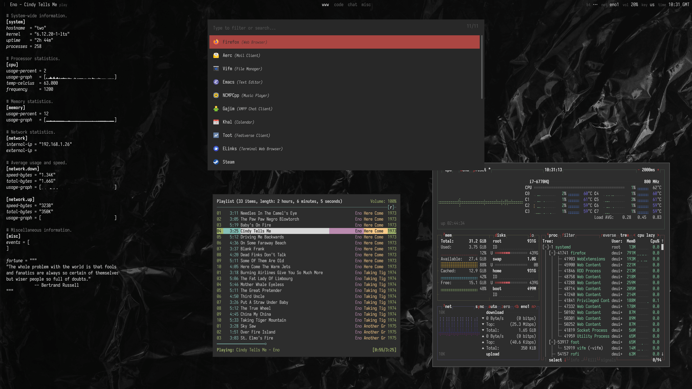

# ArchLinux Package Repository

This repository contains an assortment of package builds for ArchLinux, mainly in support of setting
up a complete, consistent system.



Check individual package folders for more specific information on their use and contents.

## Prerequisites

It is assumed that a bare-minimal, bootable system is in place before any package here is installed;
however, a long-running system with non-default system configuration might find this clashing with
configuration installed by packages. Caveat emptor.

## Adding Custom Repository

All packages defined here are available to install via a custom repository; to configure this on an
existing ArchLinux system, first download and add the repository key to `pacman`:

```sh
$ curl --silent --fail -o - https://git.deuill.org/api/packages/deuill/arch/repository.key | pacman-key --add -
```

Ensure that the key was added correctly, and sign the key:

```sh
$ pacman-key --list-keys
$ pacman-key --lsign-key 'Arch Registry' # Or whatever the key name or ID was above.
```

Then, add the repository to the bottom of `pacman.conf`:

```ini
[deuill.git.deuill.org]
SigLevel = Required
Server = https://git.deuill.org/api/packages/deuill/arch/core/$arch
```

Running `pacman -Sy` should pull repository files correctly.

## Keeping Updated

Having added the custom repository, any package installed here will be kept updated in future calls
to `pacman --sync --upgrade`. However, certain packages will also install user configuration in
`/etc/skel`, to be copied over to user home directories when users are created; the included
`skel-merge` utility helps copy files over, allowing for local modifications.

## License

All code in this repository is covered by the terms of the MIT License, the full text of which can be found in the LICENSE file.
